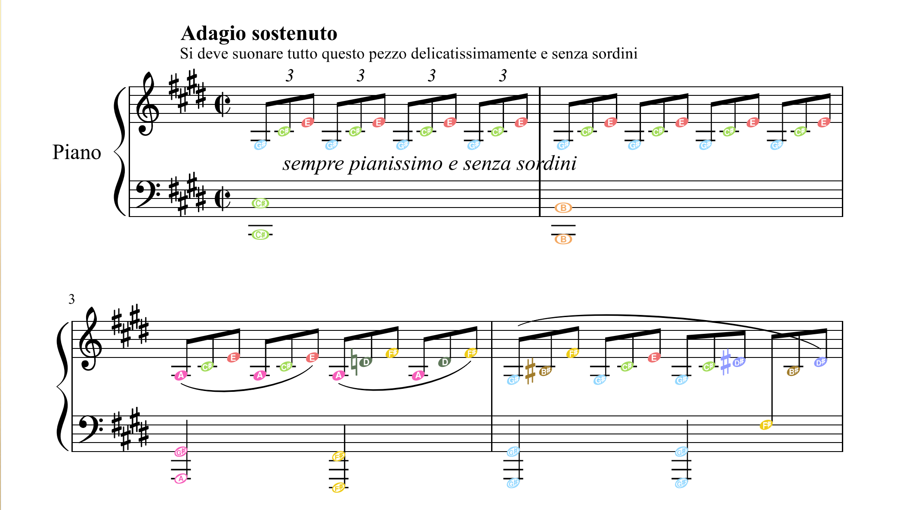

# Fun Notation

## What's the idea?

This is my experimentation on musical notations.

Want to create some applications to help me to visualize music, practice easier, and provide nicer way to show scores or tabs.

Some of current tried ideas:

### Guitar tabs to show both pitch and durations for notes


In this image, the guitar tab is shown in full feature mode, with left hand chord shape, right hand pick pattern (you can also change the setting to always show fret numbers), and above them the actually notes produced with names (in number, can also shown as Do Re Mi), and the lyrics and melody, also chords view on top, and guitar view on the left.

I think this is really useful for beginners, or try to analyse music in a deeper way.

Most of the elements can be turned on/off, e.g. after learned a tab, you may want to show the chords and lyrics when playing:


(planning to make the layout a bit nicer, [#156](https://github.com/notation-fun/notation/issues/156))

### Colors for notes

Colors are based on the relative notation.


I'm using the [Moveable Do Solfège](https://en.wikipedia.org/wiki/Solf%C3%A8ge) for the name of notes, and change the name of the root note for scales other than natural major (ionian).

In the above example (press F1 or H key in viewer to show the in-app help panel, then click the Notes tab), the song is in E dorian, so the first note's name is Re.

The benefit of moveable do is that it's easier to sing melodies, and easier for simple key transition (e.g. change G to A by using capo at the 2nd fret), but it's harder for changing scale without change root key (e.g. E major to E minor), It's easier for people without classical music training, at least it's easier for myself, so that's the current way.

The colors are mapped to note names, e.g. no matter in what key or scale, a Do is always in red, the hue of the colors are actually ordered in rainbow colors, but the order is applied in fifth.

| Note | Syllable | Pitch in C Major | Color Hue |
| - | ---- | ---------------- | --------- |
| 1 | Do | C | Red |
| 5 | So | G | Orange |
| 2 | Re | D | Yellow |
| 6 | La | A | Green |
| 3 | Mi | E | Cyan |
| 7 | Ti | B | Blue |
| 4 | Fa | F | Purple |

If you are a Musescore user, I've also forked a plugin to change color of the notes in it, which works pretty neat.

- https://github.com/notation-fun/musescore-plugin-fun-notation

You may also check the web app for all notes of different scales (modes)

- https://www.notation.fun/notation_kb/kb?lang=en-US

### Color and shapes for chords


I'm using big circle to represent the root note of a chord, so the color is a quick hint for the level of chords.

Smaller circles inside big circles are used to represent intervals in the chords, the color is the note color. there are some dots in these smaller circles, the number of dots are showing the intervals from the chord root. and the way these dots are rendered show the quality of these intervals.

| Interval Quality | Color of Dots |
| ---------------- | ------------- |
| Perfect, Major | White |
| Minor | Dark Gray |
| Diminished | Transparent Gray |
| Augmented, Tritone | Transparent Purple |

 e.g. 5 white dots means Perfect 5th, and 3 white dots means Major 3rd, and 3 Gray dots means Minor 3rd.

 After some getting used to, it's quick to identify the chords by looking at their visual representation.

 For more complex chords, more slots are added, such as 7th or 9th, and for chords using different bass, an extra slot on the bottom is added.

 This is a bit over complicate, especially for new users, but I think it's a not bad system. I'm thinking of adding the chords into each bar somehow, but haven't figured out a nice way for that yet.

 Was also interesting in the shapes used in [Tonnetz](https://en.wikipedia.org/wiki/Tonnetz), but that's even harder to memorize, and might got mental conflicts with the guitar left hand shapes. But the tonnetz is really good to show how notes related to chords which my chord visual is lacking, so may think a bit more on this.

The number on the top left corner of each chord is how many times it's been used in the current song. Also thinking about adding the standard names somewhere (e.g. V7 I vi).

## What's implemented?

### Guitar Tab + Melody + Lyrics

Features:

- audio for each notes, sound quality not good enough (esp. in browser)
- guitar fretboard synced with current played notes
- A/B repeat for selected bars


[Youtube: Canon in D](https://youtu.be/RXdFoTSl7R4)

[Try in browser](https://www.amateurguitar.com/songs/scarborough-fair/)
Note that the web version is only working properly in desktop browser, the audio is not very nice, the touch input is not working reliable on mobile browsers yet, and may have performance issues on certain devices.

[Desktop versions](https://github.com/notation-fun/notation/releases) can be downloaded from releases.

You can also build it by yourself, make sure follow the [Bevy Engine Setup](https://bevyengine.org/learn/book/getting-started/setup/) first.

```
cd app/notation_viewer
cargo run --features native
```

## How it's built?

The current version is writted in [Rust](https://www.rust-lang.org), on top of [Bevy Engine](https://bevyengine.org), started as a demo to learn both the language and the game engine, but got much progress and show some potentials quickly.

[egui](https://github.com/emilk/egui) is used for most of the gui features via [bevy_egui](https://github.com/mvlabat/bevy_egui), it's pretty nice, very easy to use (I've been using other immediate gui before).

At this moment, there is no visual editor yet, instead a DSL in Rust is created to write tabs (also serving learning purpose at the first place), it's far from perfect, and got me quite some headaches some time, but did learned a lot, and some part of it is really nice. Plan to write some blog posts later on this topic.

## Knowledge Base

Also did some quick experiment with other aspects in music theory, put them under `apps/notation_kb`, You can check the [web app](https://www.notation.fun/notation_kb/kb?lang=en-US)

Currently the most interesting one, is to use animation to visualize the harmonics, you can see why using certain fret for natural harmonics on guitar, and try hearing the different sounds.


Another one is to show all the notes in selected scale and key, e.g. F# Mixolydian


Plan to add more stuffs while learning something new, current ideas:

- [Tonnetz](https://en.wikipedia.org/wiki/Tonnetz)
- [Isomorphic Keyboards](http://www.altkeyboards.com/instruments/isomorphic-keyboards)

## What's next?

Current guitar tab is already very useful for myself, will add more tabs and adding more features when needed.

Also may do some works around other applications, e.g. add color and note names for music score help me to read and understand music better.

e.g. the following image is the first few bars of Moonlight Sonata 1st Movement, with the colors I can see the chord progression of the first 2 bars is `vi vi7/V`. (the note name is built-in feature from Musescore, I use it to help me to find the key on piano faster)



Another approach is to add some importer/exporter for my format, e.g. import from guitar pro tabs, can create tabs much faster, export to [Lilypond](http://lilypond.org/) for printed version.

Anyway, had learned a lot so far, both on the tech side with Rust, Bevy, Egui, also on the musical theory side. Both are really fun to learn, will try to spend more time on this in the future, hopefully can get something useful for more people in the end.

----
## Some Inspirations

### [Chromesthesia Color for Notes](https://en.wikipedia.org/wiki/Chromesthesia)

Most colorful notation systems using rainbow colors for notes, but I found this chromesthesia system is much better for me to feel the music, especially when apply the colors to chords.


### [Hook Theory](https://www.hooktheory.com/)

This is really awesome, have tons of materials for music learning, also has a very powerful web application.

### [Groove Pizza](https://apps.musedlab.org/groovepizza/?museid=qD-Y91QD3&)

Very nice web application to visualize rhythm.

